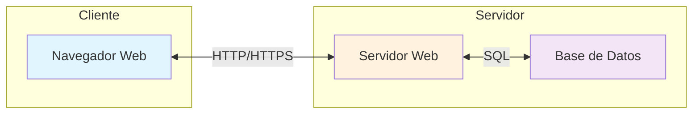

- [1. Introducción al Desarrollo Web en Entorno Servidor](#1-introducción-al-desarrollo-web-en-entorno-servidor)
  - [1.1. El Desarrollo Web Actual Web](#11-el-desarrollo-web-actual-web)
  - [1.2. Modelos de Ejecución de Código en el Servidor y en el Cliente](#12-modelos-de-ejecución-de-código-en-el-servidor-y-en-el-cliente)

# 1. Introducción al Desarrollo Web en Entorno Servidor

## 1.1. El Desarrollo Web Actual Web

¿Algunas vez has pensado lo que pasa una vez le das al botón de "Enviar" en un formulario web? ¿O cómo es posible que puedas ver tu perfil en una red social, comprar en una tienda online o ver una película en streaming desde cualquier dispositivo? ¿O que pasa cuando pones una URL en el navegador? Detrás de estas acciones aparentemente simples, hay un complejo ecosistema de tecnologías y procesos que hacen posible la experiencia web moderna.

📝 **Nota del Profesor**: Esta sección es fundamental para que el alumno entienda el "por qué" del módulo. El despliegue no es un paso aislado, sino el resultado de todo un proceso de desarrollo.

El desarrollo web moderno es un campo en constante evolución que abarca la creación y mantenimiento de sitios web y aplicaciones que operan a través de Internet. En la actualidad, el desarrollo no solo se enfoca en la funcionalidad, sino también en cómo estas aplicaciones se pondrán a disposición de los usuarios, un proceso crucial conocido como **despliegue**. Este proceso es fundamental para la viabilidad de cualquier proyecto web, ya que permite que la aplicación pase del entorno de desarrollo a un entorno de producción, donde será accesible para los usuarios finales.

Los principales objetivos del despliegue son garantizar la **accesibilidad**, la **estabilidad**, la **escalabilidad** y la **seguridad** de las aplicaciones. Un despliegue eficiente contribuye a una **rapidez en el Time-to-Market**, lo que permite a las empresas lanzar productos más rápidamente. Facilita la **iteración rápida** y la entrega continua de nuevas funcionalidades y mejoras, esencial para adaptarse a las necesidades del mercado y de los usuarios. La **automatización** de los procesos de despliegue reduce los errores humanos y aumenta la eficiencia, liberando a los equipos de desarrollo para tareas más estratégicas. Un despliegue eficaz mejora la **competitividad** de una empresa al proporcionar un servicio fiable y de alta calidad. Además, la **documentación** de todos los procesos de despliegue es indispensable para asegurar que puedan ser replicados, para la resolución de problemas y para la formación de nuevos miembros del equipo.

💡 **Tip del Examinador**: En el examen suele preguntar qué significa Time-to-Market y por qué es importante. Respuesta corta: tiempo desde que se idea un producto hasta que está disponible para el usuario.

---

## 1.2. Modelos de Ejecución de Código en el Servidor y en el Cliente

La lógica de una aplicación web se divide y ejecuta en dos entornos principales, cada uno con responsabilidades específicas: el lado del cliente y el lado del servidor.

El **código que se ejecuta en el lado del cliente** (Front-end) opera en el navegador web del usuario. Se desarrolla principalmente con HTML y CSS para la estructura y el estilo, y JavaScript para la interactividad y la lógica dinámica que ocurre en el navegador. Este código permite animaciones, validaciones de formularios y la modificación del contenido de la página sin recargarla completamente, gracias a técnicas como AJAX.

📝 **Nota del Profesor**: La validación en el cliente es una mejora de UX, pero NUNCA sustituye la validación en el servidor. El usuario puede deshabilitar JavaScript o manipular las peticiones.

Por otro lado, el **código que se ejecuta en el lado del servidor** (Back-end) corre en un servidor web o de aplicaciones. Es responsable de la lógica de negocio, la interacción con bases de datos y la generación del contenido dinámico que luego se envía al navegador del cliente.

⚠️ **Advertencia de Seguridad**: El código del servidor es la única fuente de verdad. Nunca confíes en datos que vienen del cliente sin validarlos.

Ambos modelos trabajan en conjunto: el servidor puede generar una página con contenido inicial, y el cliente puede ejecutar JavaScript para añadir interactividad, realizar validaciones preliminares en formularios o cargar datos adicionales de forma asíncrona. Por ejemplo, en una aplicación de correo web, el programa que obtiene los mensajes de una base de datos se ejecuta en el servidor, mientras que el navegador ejecuta el código que avisa si se olvida el asunto de un mensaje. Para verificar la longitud mínima de una contraseña, sería preferible que el código de comprobación se ejecutara en el navegador web, ya que no es necesario enviar la contraseña al servidor para esta tarea.

💡 **Tip del Examinador**: Pregunta típica - "¿Dónde ejecutarías la validación de un formulario de registro?" Respuesta correcta: en ambos lados, pero la del servidor es obligatoria.

📝 **Regla Nemotécnica**: "Cliente muestra, Servidor piensa". El cliente es la vitrina (muestra), el servidor es la cocina (procesa).

---

