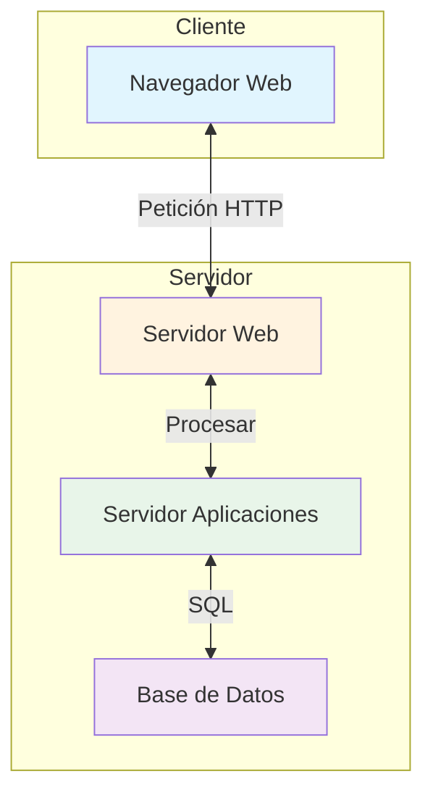
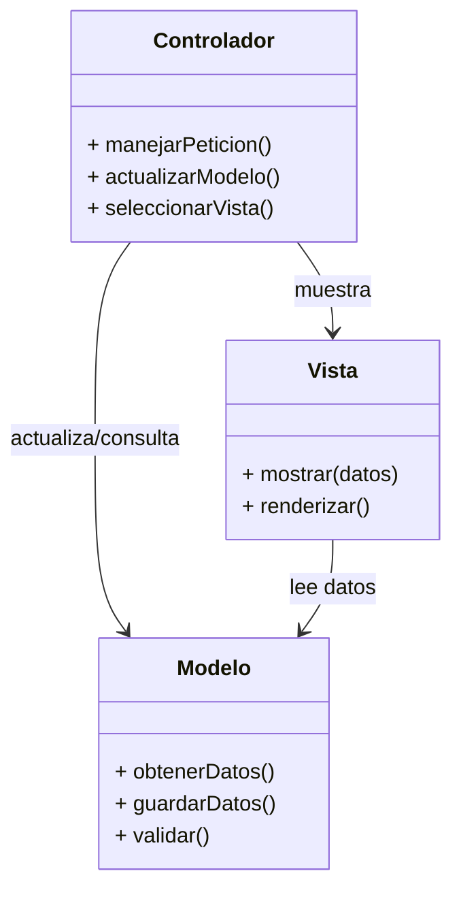
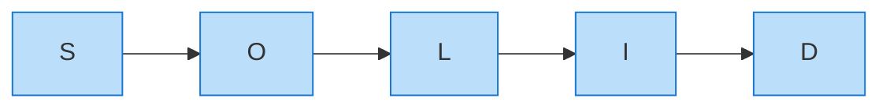

- [3. Arquitecturas Web](#3-arquitecturas-web)
  - [3.1. Aspectos Generales y Evolución de las Arquitecturas Web](#31-aspectos-generales-y-evolución-de-las-arquitecturas-web)
  - [3.2. Modelos de Arquitectura Software: Monolítica, de Capas, Microservicios y Serverless](#32-modelos-de-arquitectura-software-monolítica-de-capas-microservicios-y-serverless)
    - [3.2.1. Monolítica, de Capas, Servicios Web, Microservicios y Serverless](#321-monolítica-de-capas-servicios-web-microservicios-y-serverless)
    - [3.2.2. Modelo-Vista-Controlador (MVC)](#322-modelo-vista-controlador-mvc)
  - [3.3. Patrones de Diseño Introductorios](#33-patrones-de-diseño-introductorios)

# 3. Arquitecturas Web

## 3.1. Aspectos Generales y Evolución de las Arquitecturas Web

Las arquitecturas web son modelos que describen la forma en que los distintos elementos que participan en el intercambio y procesamiento de información a través de Internet se relacionan y funcionan. El modelo fundamental es la **Arquitectura Cliente-Servidor**, donde uno o varios clientes (navegadores web) solicitan servicios a un servidor.

**Ventajas de la Arquitectura Cliente-Servidor**:

*   **Centralización del control**: El servidor gestiona accesos, recursos y la integridad de los datos, facilitando actualizaciones.
*   **Escalabilidad**: Se puede aumentar la capacidad de clientes y servidores por separado.
*   **Portabilidad**: La ejecución de la aplicación web en un navegador web independiza el software del sistema operativo cliente.
*   **Fácil mantenimiento**: Al distribuir las funciones y responsabilidades entre varios ordenadores independientes, es posible reemplazar, reparar, actualizar, o incluso trasladar un servidor, sin que sus clientes se vean afectados (o mínimamente). Esta independencia de los cambios también se conoce como **encapsulación**.
*   Existen **tecnologías** suficientemente desarrolladas para seguridad en transacciones, usabilidad de la interfaz y facilidad de uso.

📝 **Nota del Profesor**: La arquitectura cliente-servidor es el modelo fundamental sobre el que se construye toda la web. Entiende esto y el resto te será más fácil.

**Desventajas de la Arquitectura Cliente-Servidor (sin técnicas de mitigación)**:

*   **Congestión del tráfico**: Puede ocurrir sobrecarga si muchos clientes envían peticiones simultáneas.
*   **Fallo del servidor**: Si el servidor cae, las peticiones no pueden ser satisfechas.
*   **Software y hardware específico**: Puede requerir soluciones específicas que aumentan el coste.

💡 **Tip del Examinador**: Las desventajas se mitigan con escalabilidad vertical (más potente) y horizontal (más servidores). Esta es una pregunta típica de examen.

⚠️ **Advertencia de Seguridad**: Un punto único de fallo (SPOF) en el servidor es un riesgo. Usar redundancia y balanceo de carga.

La web ha experimentado una notable **evolución**:

| Generación | Características | Ejemplo |
|------------|-----------------|---------|
| **Web 1.0** | Contenidos estáticos, escasa interacción | Webs corporativas informativas |
| **Web 1.5** | Primeros sitios dinámicos, bases de datos | Foros, portales con CMS |
| **Web 2.0** | Contenido generado por usuario, redes sociales | Facebook, YouTube, Wikipedia |
| **Web 2.5** | Web simbiótica, personalización | Recomendaciones, anuncios personalizados |
| **Web 3.0** | Web semántica, IA, datos enlazados | Asistentes inteligentes, blockchain |

📝 **Regla Nemotécnica**: "1.0 = Leer, 2.0 = Escribir/Participar, 3.0 = Entender/Semántico"

---

## 3.2. Modelos de Arquitectura Software: Monolítica, de Capas, Microservicios y Serverless

Una arquitectura de software se refiere a la estructura organizativa fundamental de un sistema de software. Define cómo se dividen, combinan y coordinan sus componentes para lograr los objetivos del sistema. En el desarrollo de aplicaciones web del lado del servidor (*backend*), existen varias arquitecturas principales.

### 3.2.1. Monolítica, de Capas, Servicios Web, Microservicios y Serverless

| Arquitectura | Descripción | Cuándo Usarla |
|--------------|-------------|---------------|
| **Monolítica** | Todo en un solo bloque. Lógica, UI y datos juntos. | Proyectos pequeños, MVPs |
| **De Capas** | Separación en capas lógicas (presentación, negocio, datos). | Aplicaciones empresariales |
| **Microservicios** | Servicios pequeños e independientes que se comunican. | Grandes sistemas, equipos múltiples |
| **Serverless** | El proveedor gestiona la infraestructura. | Funciones esporádicas, bajo coste |

*   **Arquitectura Monolítica**: Es un enfoque tradicional en el que todos los componentes de una aplicación web se agrupan en un solo bloque. La lógica de negocio, la interfaz de usuario y la capa de acceso a datos se encuentran dentro de la misma aplicación. Es fácil de desarrollar y desplegar inicialmente, pero puede volverse complejo y difícil de mantener a medida que la aplicación crece. Todos los componentes se ejecutan en el mismo proceso y comparten recursos. La escalabilidad puede ser un desafío, ya que la aplicación se ejecuta en una sola instancia. Los cambios en una parte de la aplicación pueden afectar a otras partes.

*   **Arquitectura de Capas**: Esta arquitectura divide la aplicación en diferentes capas lógicas, donde cada capa tiene una responsabilidad específica. Las capas típicas incluyen la capa de presentación, la capa de lógica de negocio y la capa de acceso a datos. Cada capa se comunica con la capa adyacente a través de interfaces bien definidas. Mejora la modularidad y la reutilización del código, permite cambios en una capa sin afectar a las demás y facilita la escalabilidad y el mantenimiento del sistema.

*   **Arquitectura de Servicios Web**: Esta arquitectura se basa en la comunicación entre diferentes servicios a través de protocolos web estándar, como HTTP. Cada servicio es una unidad independiente que se puede desarrollar, desplegar y escalar de forma independiente. Los servicios se comunican entre sí para cumplir con los requisitos de la aplicación. Favorece la modularidad y la independencia de los servicios, permite la integración de diferentes tecnologías y lenguajes de programación y facilita la escalabilidad horizontal.

*   **Arquitectura Basada en Microservicios**: Es una evolución de la arquitectura de servicios web, donde los servicios se dividen en componentes aún más pequeños y autónomos llamados microservicios. Cada microservicio se enfoca en una tarea específica y se comunica con otros microservicios a través de protocolos ligeros. Cada microservicio se puede desarrollar, desplegar y escalar de forma independiente. Mejora la flexibilidad y la agilidad del desarrollo y permite la adopción de diferentes tecnologías y enfoques dentro de cada microservicio. Un ejemplo notable es la arquitectura de *backend* de Netflix.

*   **Arquitectura Serverless**: En este modelo, el proveedor de nube gestiona toda la infraestructura del servidor, y los desarrolladores solo se preocupan por escribir el código de la aplicación. Esto ofrece escalabilidad automática y pago por uso.

*   **Service-Oriented Architecture (SOA)**: Es un enfoque de diseño de software donde los componentes del sistema se organizan como servicios independientes que se comunican entre sí a través de interfaces bien definidas. Cada servicio es una unidad autónoma que realiza una función específica y puede ser reutilizado en diferentes aplicaciones. SOA promueve la interoperabilidad, la flexibilidad y la escalabilidad al permitir que los servicios se desarrollen, desplieguen y mantengan de forma independiente.

*   **Event Driven Architecture (EDA)**: En esta arquitectura, los componentes del sistema se comunican mediante eventos. Un componente emite un evento cuando ocurre una acción significativa, y otros componentes pueden suscribirse a estos eventos para reaccionar en consecuencia. Esto permite una mayor flexibilidad y desacoplamiento entre los componentes del sistema.

📝 **Nota del Profesor**: No existe una arquitectura "mejor". Cada una tiene sus casos de uso. Elegir microservicios para una aplicación simple es como usar un Fórmula 1 para ir al supermercado.

**Tabla Comparativa de Arquitecturas Software**:

| Característica | **Monolítica** | **De Capas** | **Microservicios** | **Serverless** |
| :---------------------- | :------------------------------------------ | :-------------------------------------------------- | :----------------------------------------------------- | :--------------------------------------------------------- |
| **Complejidad Inicial** | Baja (fácil desarrollo y despliegue) | Media (modular, pero aún una única aplicación) | Alta (gestión y despliegue complejos) | Media (abstracción, pero desafíos de monitoreo) |
| **Escalabilidad** | Difícil de escalar componentes independientes | Buena (facilita la escalabilidad y mantenimiento) | Independiente por servicio (alta) | Automática (muy alta) |
| **Resiliencia** | Un fallo puede afectar toda la aplicación | Un fallo en una capa afecta a su funcionalidad | Alta (fallo de un servicio no afecta al resto) | Alta (proveedor gestiona tolerancia a fallos) |
| **Mantenimiento** | Se vuelve complejo a medida que crece | Facilita el mantenimiento | Flexible y ágil, fácil de actualizar individualmente | Reducción de la administración del servidor |
| **Flexibilidad Tec.** | Baja (todo en una pila tecnológica) | Baja (puede permitir diferentes lenguajes por capa) | Alta (diferentes tecnologías por microservicio) | Muy alta (independencia tecnológica por función) |
| **Coste** | Puede ser bajo inicialmente | Moderado | Puede ser más alto por complejidad de infraestructura | Pago por uso (potencialmente bajo si el uso es esporádico) |
| **Tiempo de Desp.** | Largos ciclos de despliegue | Moderados | Agilidad en despliegue de pequeños cambios | Muy rápido para funciones individuales |
| **Comunicación** | En memoria (rápida) | En memoria o a través de interfaces bien definidas | Mayor sobrecarga entre servicios (red) | Vía eventos o API Gateway (latencia de "arranque en frío") |
| **Ideal para** | Proyectos pequeños, MVPs | Aplicaciones empresariales con requisitos claros | Aplicaciones complejas, grandes empresas (ej. Netflix) | Funciones esporádicas, microservicios específicos |

💡 **Tip del Examinador**: Pregunta frecuente: "¿Cuáles son las ventajas de microservicios sobre monolito?" Respuesta: Escalabilidad independiente, equipos autónomos, resiliencia, tecnología heterogénea.

**Macroservicios vs. Microservicios vs. Serverless vs SOA vs EDA**:

El término "Macroservicios" no es una arquitectura formal, pero a menudo se usa para describir aplicaciones que, aunque modularizadas, no alcanzan la granularidad y autonomía de los microservicios, o bien para referirse a arquitecturas monolíticas grandes.

La tendencia hacia los **Microservicios** se debe a la necesidad de construir sistemas más **flexibles, escalables y resilientes** en un entorno de desarrollo ágil. Mientras que un monolito requiere escalar toda la aplicación incluso si solo una pequeña parte tiene alta demanda, los microservicios permiten escalar de forma independiente cada componente. Esto facilita que equipos pequeños trabajen de forma autónoma, elijan sus propias tecnologías y desplieguen con mayor frecuencia y menor riesgo. El fallo de un microservicio no afecta a toda la aplicación, mejorando la resiliencia. Sin embargo, esta flexibilidad viene con una **mayor complejidad de gestión y despliegue**.

📝 **Regla Nemotécnica**: "Mono = Uno para todo, Micro = Muchos para cada cosa"

**Serverless** va un paso más allá, eliminando la preocupación por los servidores. Aunque puede verse como una evolución de los microservicios, no todos los microservicios son Serverless. Serverless es ideal para funciones cortas y bajo demanda que pueden beneficiarse de la escalabilidad automática y el pago por uso, pero tiene limitaciones de tiempo de ejecución y posibles latencias de "arranque en frío".

**Service-Oriented Architecture (SOA)** es un enfoque más amplio que puede incluir microservicios, pero se centra en la interoperabilidad y la reutilización de servicios a través de una arquitectura orientada a servicios. SOA puede ser más adecuado para organizaciones grandes con sistemas heredados que necesitan integrarse.

**Event Driven Architecture (EDA)** es un enfoque que puede complementar tanto a los microservicios como a las arquitecturas Serverless. En EDA, los componentes del sistema reaccionan a eventos, lo que permite una mayor flexibilidad y desacoplamiento. Esto es especialmente útil en sistemas distribuidos donde la comunicación asíncrona puede mejorar la escalabilidad y la resiliencia.

⚠️ **Advertencia de Seguridad**: Los microservicios tienen más superficie de ataque. Cada servicio es un potencial punto de entrada para atacantes.

---

### 3.2.2. Modelo-Vista-Controlador (MVC)

El **Modelo-Vista-Controlador (MVC)** es un modelo de arquitectura que separa los datos y la lógica de negocio de la interfaz de usuario y el componente encargado de gestionar los eventos y las comunicaciones.

Al separar los componentes en elementos conceptuales permite reutilizar el código y mejorar su organización y mantenimiento. Sus elementos son:

*   **Modelo**: representa la información y gestiona todos los accesos a ésta, tanto consultas como actualizaciones provenientes, normalmente, de una base de datos. Se accede via el controlador.
*   **Controlador**: Responde a las acciones del usuario, y realiza peticiones al Modelo para solicitar información. Tras recibir la respuesta del modelo, le envía los datos a la Vista.
*   **Vista**: Presenta al usuario de forma visual el Modelo y los datos preparados por el Controlador. El usuario interactura con la Vista y realiza nuevas peticiones al Controlador.

📝 **Nota del Profesor**: MVC es el patrón que vais a usar en el primer proyecto. Entiende bien cómo fluyen los datos: Usuario → Vista → Controlador → Modelo → Controlador → Vista.

💡 **Tip del Examinador**: En el examen práctico, os pedirán identificar qué parte del código corresponde a Modelo, Vista o Controlador. Memoriza las responsabilidades de cada uno.

En este modelo, es el servidor el que lleva el peso principal tanto del procesado de la información como de su representación. El cliente web se dedica a enviar las peticiones al servidor, recibir la respuesta y representarla en pantalla. La página web (código HTML, JavaScript, etc.) se predetermina en el lado del servidor. Con este modelo, cada petición del cliente al servidor implicará un refresco de la información que se visualiza en la pantalla, aunque su apariencia haya cambiado poco. Esto implica que se vuelvan a descargar todos los datos y ficheros que no se mantengan en la caché del navegador, con lo que los tiempos de respuesta serán mayores. El usuario final apreciará que, por un intervalo corto de tiempo, todos los elementos de la pantalla desaparecen y después se conforma de nuevo la interfaz de usuario. En este caso, se dice que la aplicación no es **reactiva**. Este modelo de programación MVC se ajustará al primer proyecto del curso.

⚠️ **Advertencia de Seguridad**: En MVC, el Controlador es el punto de entrada. Validar siempre las entradas antes de pasarlas al Modelo.

---

## 3.3. Patrones de Diseño Introductorios

Los patrones de diseño son soluciones generalmente aplicables a problemas comunes en el diseño de software. Proporcionan un enfoque probado y estructurado para resolver problemas recurrentes y mejorar la calidad y flexibilidad del código.

**Principios SOLID**:

| Principio | Nombre | Descripción | Ejemplo Práctico |
|-----------|--------|-------------|------------------|
| **S** | Single Responsibility | Una clase debe tener una sola razón para cambiar | Clase Usuario solo gestiona datos de usuario |
| **O** | Open/Closed | Abierto para extensión, cerrado para modificación | Usar interfaces para añadir funcionalidad |
| **L** | Liskov Substitution | subclases deben poder sustituir a padres | Pajaro/Loro hereda de Ave correctamente |
| **I** | Interface Segregation | Clientes no dependen de interfaces que no usan | Varias interfaces pequeñas vs una grande |
| **D** | Dependency Inversion | Depender de abstracciones, no de concreciones | Inyectar repositories en servicios |

*   Los **Principios SOLID** son cinco principios que guían el diseño de software orientado a objetos para crear sistemas más robustos, mantenibles y escalables:
    1.  **Principio de responsabilidad única (SRP)**: Una clase debe tener una, y solo una, razón para cambiar.
    2.  **Principio abierto/cerrado (OCP)**: Las entidades de software deben estar abiertas para la extensión, pero cerradas para la modificación.
    3.  **Principio de sustitución de Liskov (LSP)**: Los objetos de una superclase deben poder ser reemplazados por objetos de una subclase sin afectar la corrección del programa.
    4.  **Principio de segregación de interfaces (ISP)**: Los clientes no deben ser forzados a depender de interfaces que no usan.
    5.  **Principio de inversión de dependencias (DIP)**: Los módulos de alto nivel no deben depender de los módulos de bajo nivel; ambos deben depender de abstracciones.

📝 **Nota del Profesor**: SOLID parece abstracto ahora, pero cuando tengáis que mantener código de otros (o el vuestro de hace 6 meses), lo agradeceréis.

*   Existen otros **Tipos de Patrones de Diseño** que se clasifican en patrones de creación (cómo se instancian los objetos), estructurales (cómo se componen las clases y objetos), de comportamiento (cómo interactúan los objetos) y arquitectónicos (estructuras globales de las aplicaciones, como MVC o Microservicios).

💡 **Tip del Examinador**: En el examen teórico, preguntan qué significa cada letra de SOLID. Aprovéchalo, son 5 puntos fáciles.

📝 **Regla Nemotécnica**: "SOLID = Solo Léeme Introduciendo Documentos" (las iniciales de cada principio)

---

