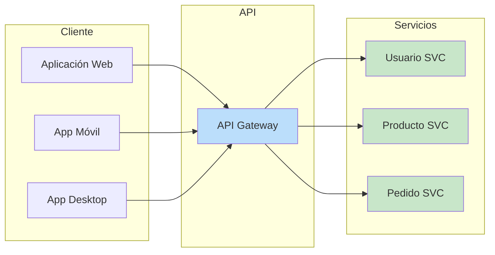
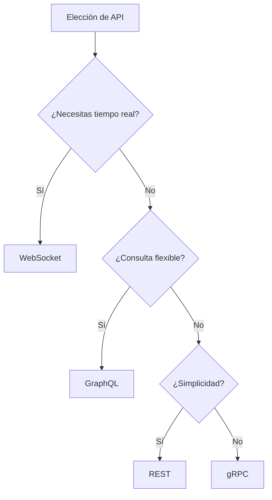
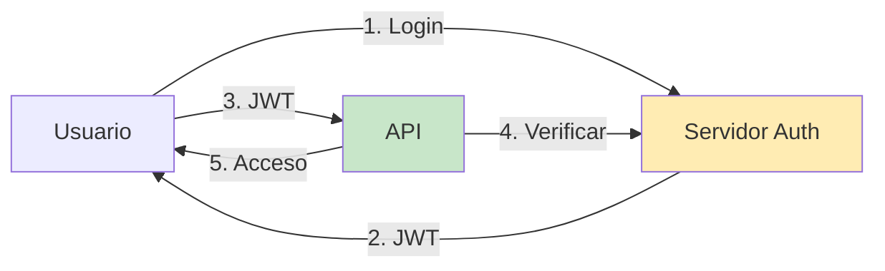

- [5. Servicio Web y Comunicación con APIs](#5-servicio-web-y-comunicación-con-apis)
  - [5.1. ¿Qué es un Servicio Web y Qué Aporta?](#51-qué-es-un-servicio-web-y-qué-aporta)
  - [5.2. Diferencia entre un Servicio Web y una Página Web Dinámica](#52-diferencia-entre-un-servicio-web-y-una-página-web-dinámica)
  - [5.3. Protocolos de Comunicación de API](#53-protocolos-de-comunicación-de-api)
    - [5.3.6. Otros Protocolos y Estilos de Comunicación (mención breve)](#536-otros-protocolos-y-estilos-de-comunicación-mención-breve)
  - [5.4. JWT (JSON Web Token) - Concepto de Autenticación y Autorización](#54-jwt-json-web-token---concepto-de-autenticación-y-autorización)
  - [5.5. Ejemplo de arquitectura Netflix](#55-ejemplo-de-arquitectura-netflix)


# 5. Servicio Web y Comunicación con APIs

## 5.1. ¿Qué es un Servicio Web y Qué Aporta?

Un **servicio web** (o Web Service) es una **API (Application Programming Interface)** que permite a otra aplicación comunicarse remotamente para acceder a un servicio. Son conjuntos de reglas y protocolos que permiten a diferentes aplicaciones o sistemas comunicarse y compartir datos a través de la web. Se basan en protocolos web estándar como HTTP y utilizan formatos de intercambio de datos como JSON o XML. Cada funcionalidad o servicio expuesto por una API se identifica a menudo mediante un *endpoint* (URL en el lado servidor).



Los servicios web son **fundamentales en el desarrollo de aplicaciones modernas**. Aportan:

*   **Integración**: Permiten que diferentes sistemas se conecten y compartan funcionalidades, como una aplicación de escritorio publicando en Twitter vía su API.
*   **Flexibilidad y Escalabilidad**: Facilitan la creación de aplicaciones más robustas y escalables al dividir funcionalidades en servicios independientes.
*   **Reutilización**: Un servicio puede ser consumido por múltiples clientes (web, móvil, escritorio).
*   **Agnosticismo**: El Back-end se vuelve agnóstico al cliente, entregando datos que cada cliente representa a su manera.

📝 **Nota del Profesor**: Piensa en una API como un restaurante: la cocina (servidor) prepara la comida (datos), tú (cliente) solo pides (petición) y recibes el plato (respuesta). No necesitas saber cómo cocinaron.

💡 **Tip del Examinador**: "Endpoint" es simplemente una URL que expone un servicio. Cada endpoint = una funcionalidad.

---

## 5.2. Diferencia entre un Servicio Web y una Página Web Dinámica

La distinción entre un servicio web y una página web dinámica radica en su propósito y la naturaleza de su interacción:

| Aspecto | Página Web Dinámica | Servicio Web (API) |
|---------|--------------------|-------------------|
| **Objetivo** | Mostrar al usuario final | Compartir datos entre apps |
| **Salida** | HTML para navegador | JSON/XML para aplicaciones |
| **Consumidor** | Humanos (navegador) | Máquinas (apps) |
| **Ejemplo** | Ver perfil de Facebook | App móvil consulta perfil |

*   Una **página web dinámica** está diseñada para **generar contenido HTML (u otros formatos interpretables por un navegador)** que el usuario final visualiza en su navegador. Su objetivo principal es la presentación y la interacción directa con el usuario a través de una interfaz gráfica.

*   Un **servicio web (API)**, por el contrario, está diseñado para **exponer datos y funcionalidades** a *otras aplicaciones*, no directamente a usuarios finales a través de una interfaz gráfica. Aunque se accede vía HTTP, su respuesta no es una página HTML para el usuario, sino **datos estructurados** (JSON, XML) que otras aplicaciones consumen para luego mostrarlos o procesarlos. Es el "lenguaje" que hablan las máquinas entre sí.

📝 **Nota del Profesor**: Analogía: Una página web dinámica es como un restaurante donde te sientas y comes. Una API es como el servicio de reparto a domicilio: tú recibes los ingredientes (datos) y los preparas como quieras.

En una arquitectura moderna, una página web dinámica (especialmente una SPA) puede consumir múltiples servicios web para construir su interfaz y obtener datos, mientras que los servicios web actúan como el *backbone* de datos para esta y otras aplicaciones.


💡 **Tip del Examinador**: Pregunta frecuente: "¿Qué devuelve una API?" No devuelve HTML, devuelve datos (JSON/XML).

---

## 5.3. Protocolos de Comunicación de API

La elección del protocolo de comunicación de API adecuado es una decisión arquitectónica crítica que impactará el rendimiento, la escalabilidad, la experiencia del usuario e incluso los costes del proyecto. Comprender las fortalezas y debilidades de los diferentes protocolos es esencial.



**Comparativa de Protocolos de API**:

| Protocolo | Formato | Comunicación | Ventajas | Desventajas | Ideal Para |
|-----------|---------|--------------|----------|-------------|------------|
| **REST** | JSON/XML | HTTP estándar | Simple, escalable, cacheable | Over-fetching | APIs públicas, CRUD |
| **GraphQL** | JSON | HTTP POST | Flexible, una petición | Complejo servidor | UIs complejas |
| **gRPC** | Protobuf | HTTP/2 | Rápido, tipado | No legible, proxies | Microservicios |
| **WebSocket** | Texto/Binario | TCP persistente | Tiempo real, bidireccional | Con estado | Chat, juegos |
| **SOAP** | XML | HTTP/POST | Formal, seguro | Verboso, complejo | Empresas, legacy |

**REST (Representational State Transfer)**:

*   Estilo arquitectónico basado en HTTP para operaciones CRUD (Crear, Leer, Actualizar, Borrar) sobre recursos.
*   Los recursos se identifican mediante URLs.
*   Utiliza métodos HTTP estándar (GET, POST, PUT, DELETE).
*   **Ventajas**: Sencillo, familiar, escalable, sin estado, fácil de cachear.
*   **Desventajas**: Sobre/sub-obtención de datos.

**GraphQL**:

*   Lenguaje de consulta para APIs web.
*   Permite solicitar **exactamente los datos que necesitan** en una sola petición.
*   **Ventajas**: Evita sobre-obtención, reduce peticiones, tipado fuerte.
*   **Desventajas**: Complejidad en servidor, dificultad para cachear.

**gRPC (Google Remote Procedure Call)**:

*   Framework RPC moderno de alto rendimiento.
*   Permite llamar a funciones remotas como si fueran locales.
*   Utiliza Protocol Buffers (serialización binaria).
*   Basado en HTTP/2.
*   **Ventajas**: Extremadamente rápido, bajo latencia, streaming bidireccional.
*   **Desventajas**: Menos legible, requiere proxy para navegadores.

**WebSocket**:

*   Protocolo de comunicación persistente y bidireccional.
*   Después de handshake HTTP inicial, conexión TCP persistente.
*   Cliente y servidor pueden enviar mensajes en cualquier momento.
*   **Ventajas**: Tiempo real verdadero, comunicación full-duplex.
*   **Desventajas**: Con estado, escalabilidad compleja.

**SOAP (Simple Object Access Protocol)**:

*   Protocolo de mensajería basado en XML.
*   Más antiguo y formal que REST.
*   **Ventajas**: Altamente estandarizado, extensible, independiente del lenguaje.
*   **Desventajas**: Verboso, complejo, menos legible.

📝 **Nota del Profesor**: Para este módulo, REST es el estándar que vais a usar. Los demás son para especializaciones posteriores.

💡 **Tip del Examinador**: En el examen preguntan: "¿Qué protocolo usarías para un chat en tiempo real?" WebSocket.


### 5.3.6. Otros Protocolos y Estilos de Comunicación (mención breve)

*   **Webhook**: Mecanismo de callback HTTP que permite a un servicio enviar notificaciones a una URL preconfigurada cuando ocurre un evento.
*   **MQTT**: Protocolo ligero de publicación-subscripción para dispositivos IoT con recursos limitados.
*   **Server-Sent Events (SSE)**: Permite al servidor enviar actualizaciones unidireccionales al cliente a través de HTTP. Más simple que WebSocket.
*   **Apache Kafka**: Plataforma distribuida de streaming de eventos para procesamiento en tiempo real.

---

## 5.4. JWT (JSON Web Token) - Concepto de Autenticación y Autorización

Un **JSON Web Token (JWT)** es un estándar abierto para crear tokens de acceso que permiten intercambiar información de forma segura entre dos partes como un objeto JSON firmado digitalmente. Son ampliamente utilizados para la autenticación y autorización en APIs web modernas.



**Estructura del JWT**:

```
JWT = Header.Payload.Signature

Ejemplo:
eyJhbGciOiJIUzI1NiIsInR5cCI6IkpXVCJ9.
eyJzdWIiOiIxMjM0NTY3ODkwIiwibmFtZSI6IkpvaG4gRG9lIiwiaWF0IjoxNTE2MjM5MDIyfQ.
SflKxwRJSMeKKF2QT4fwpMeJf36POk6yJV_adQssw5c
```

*   **Header (Encabezado)**: Contiene el tipo de token (JWT) y el algoritmo de firma utilizado.
*   **Payload (Carga Útil)**: Contiene las "reclamaciones" (claims), que son declaraciones sobre el usuario (ID, nombre, rol, expiración).
*   **Signature (Firma)**: Se crea tomando header + payload codificados y firmándolos con una clave secreta.

**Ventajas de JWT**:

*   **Sin estado**: El servidor no necesita almacenar sesiones.
*   **Escalable**: Funciona en entornos distribuidos.
*   **Portátil**: Puede usarse entre diferentes dominios.

**Desventajas de JWT**:

*   **Difícil de revocar**: Hasta que expire, el token es válido.
*   **Payload limitado**: No almacenar datos sensibles.

📝 **Nota del Profesor**: JWT es como un DNI digital. El servidor "confía" en él porque está firmado (como un DNI tiene un holograma).

💡 **Tip del Examinador**: Pregunta asegurada: "¿Qué partes tiene un JWT?" Header, Payload, Signature.

⚠️ **Advertencia de Seguridad**: JWT robado = acceso concedido. Usar HTTPS, expiración corta, y considerar refresh tokens.


---

## 5.5. Ejemplo de arquitectura Netflix

Netflix utiliza una arquitectura orientada a **microservicios** que les permite separar su plataforma en servicios pequeños e independientes. Esto mejora la escalabilidad, la disponibilidad y la fiabilidad de la plataforma.

**Arquitectura de Microservicios**:

| Microservicio | Función |
|---------------|---------|
| Auth Service | Autenticación de usuarios |
| Profile Service | Gestión de perfiles |
| Recommendation Service | Sistema de recomendaciones |
| Streaming Service | Distribución de contenido |
| Billing Service | Pagos y facturación |

*   **Microservicios**: Cada función, como la autenticación de usuarios, la gestión de perfiles o las recomendaciones de contenido, se ejecuta como un servicio individual. Esto permite que los equipos de desarrollo trabajen y desplieguen servicios de forma independiente.
*   **Basado en la nube**: Netflix migró completamente a **Amazon Web Services (AWS)**, lo que le permite escalar recursos de forma dinámica según la demanda.
*   **Open Connect**: Es su propia red de distribución de contenido (CDN) global. Este sistema almacena copias del contenido de Netflix en servidores locales de los proveedores de servicios de internet (ISP) para acercar el contenido a los usuarios, reduciendo la latencia y la carga en la red.

**Tecnologías Front-end**:

*   **JavaScript y React**: El sitio web y las aplicaciones para Smart TVs utilizan JavaScript con React para construir componentes y páginas de manera eficiente.
*   **HTML y CSS**: Son la base para la estructura y el diseño visual de la interfaz.

**Tecnologías Back-end**:

*   **Java**: Es el lenguaje principal para la mayoría de los microservicios. Su rendimiento, escalabilidad y robustez lo hacen ideal para el núcleo de la arquitectura.
*   **Spring Boot**: Framework utilizado para crear microservicios de forma rápida y eficiente.
*   **Cassandra**: Base de datos distribuida de Netflix para almacenar grandes volúmenes de datos.

📝 **Nota del Profesor**: Netflix es el ejemplo clásico de microservicios. Si en el examen preguntan por un caso real de arquitectura de microservicios, Netflix es la respuesta.

---
