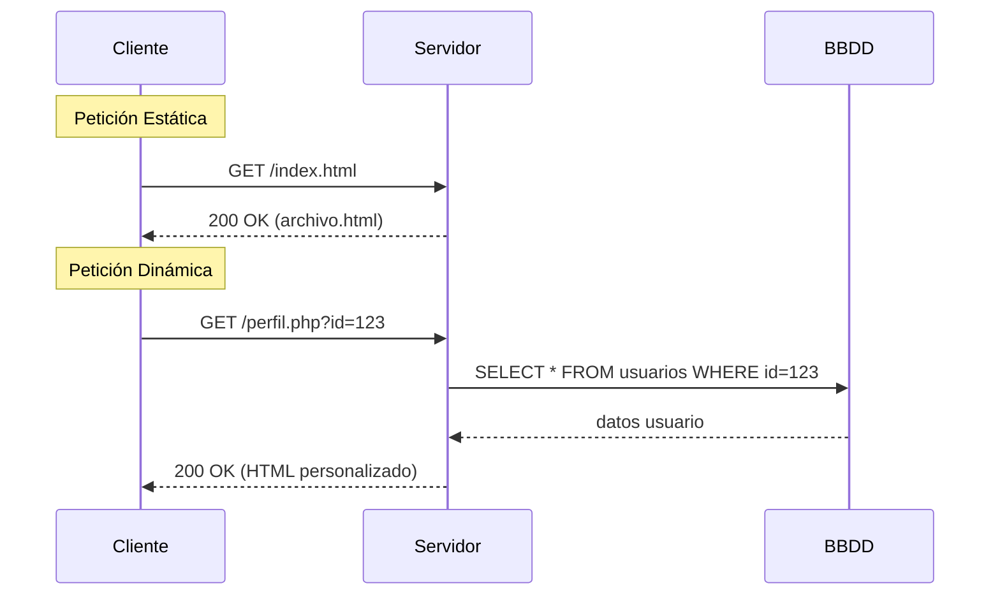
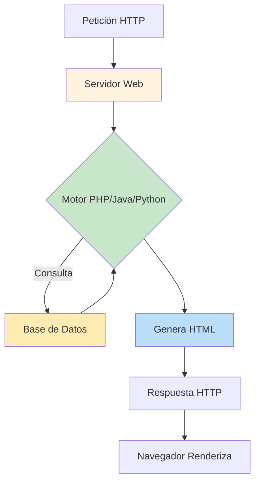
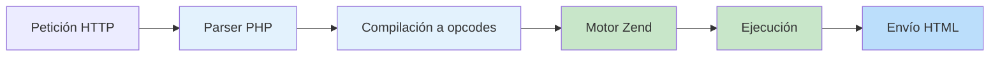

- [6. Funcionamiento de una Web Dinámica y Generación de Contenido](#6-funcionamiento-de-una-web-dinámica-y-generación-de-contenido)
  - [6.1. Páginas estáticas vs. Páginas dinámicas](#61-páginas-estáticas-vs-páginas-dinámicas)
  - [6.2. Cómo Funciona una Página Web Dinámica](#62-cómo-funciona-una-página-web-dinámica)
  - [6.3. Tecnologías de Generación de Páginas Web Dinámicas y Ejemplos "Hola Mundo"](#63-tecnologías-de-generación-de-páginas-web-dinámicas-y-ejemplos-hola-mundo)
    - [Lenguajes y Tecnologías del Lado del Servidor](#lenguajes-y-tecnologías-del-lado-del-servidor)
    - [Ejemplo "Hola Mundo" en Diferentes Lenguajes](#ejemplo-hola-mundo-en-diferentes-lenguajes)
    - [Ciclo de Vida de una Petición en PHP](#ciclo-de-vida-de-una-petición-en-php)
    - [Tipos de Ejecución de Lenguajes del Lado del Servidor](#tipos-de-ejecución-de-lenguajes-del-lado-del-servidor)


# 6. Funcionamiento de una Web Dinámica y Generación de Contenido

## 6.1. Páginas estáticas vs. Páginas dinámicas

| Aspecto | Página Estática | Página Dinámica |
|---------|----------------|-----------------|
| **Contenido** | Fijo, predefinido | Generado en tiempo real |
| **Generación** | No requiere servidor | Requiere servidor web |
| **Base de datos** | No usa | Sí usa |
| **Interactividad** | Limitada | Alta |
| **Mantenimiento** | Manual | Automático |
| **Ejemplo** | Landing page corporativa | Panel de usuario, tienda online |

Una **página web estática** es un archivo HTML que existe tal cual en el servidor. Cuando un cliente lo solicita, el servidor lo envía sin modificar. Es como un documento Word guardado en un servidor: siempre igual.

Una **página web dinámica** se genera en el momento de la petición. El servidor combina plantillas con datos (normalmente de una base de datos) para crear el HTML específico para esa petición. Es como un restaurante donde el chef prepara tu plato cuando lo pides, no tiene un plato ya hecho esperando.

**Comparativa del Flujo de Petición**:



📝 **Nota del Profesor**: Una página .html puede ser estática aunque tenga extensiones .php. Lo que importa es si el servidor la procesa o no.

---

## 6.2. Cómo Funciona una Página Web Dinámica

El proceso de generación de una página dinámica sigue estos pasos:

**1. Petición del Cliente**:
El navegador envía una petición HTTP al servidor web con una URL que indica el recurso solicitado.

**2. Recepción por el Servidor Web**:
El servidor web recibe la petición y la dirige al módulo de procesamiento correspondiente según la extensión del archivo.

**3. Ejecución del Código del Lado del Servidor**:
El servidor ejecuta el código del script (PHP, Java, Python, etc.). Este código puede:
- Acceder a bases de datos
- Procesar formularios
- Leer/escribir archivos
- Generar contenido personalizado

**4. Generación del HTML**:
El código del servidor combina plantillas HTML con los datos procesados para crear el HTML final.

**5. Envío de la Respuesta**:
El servidor envía el HTML generado de vuelta al navegador del cliente con el código de estado apropiado.

**6. Renderizado en el Navegador**:
El navegador recibe el HTML y lo renderiza para mostrar la página al usuario.



💡 **Tip del Examinador**: En el examen práctico, os pedirán seguir el flujo de una petición. Identificar cada paso: petición → servidor → BD → generación → respuesta.

⚠️ **Advertencia de Seguridad**: Cada petición a la BD es una oportunidad para SQL Injection. Siempre usar consultas parametrizadas.

---

## 6.3. Tecnologías de Generación de Páginas Web Dinámicas y Ejemplos "Hola Mundo"

### Lenguajes y Tecnologías del Lado del Servidor

| Lenguaje | Tecnología | Extensión Típica | Framework Popular |
|----------|------------|------------------|-------------------|
| **PHP** | PHP nativo | .php | Laravel, Symfony |
| **Java** | JSP/Servlets | .jsp | Spring Boot |
| **Python** | Django/Flask | .py | Django, Flask |
| **C#** | ASP.NET | .aspx | ASP.NET Core |
| **JavaScript** | Node.js | .js | Express.js |

### Ejemplo "Hola Mundo" en Diferentes Lenguajes

**PHP**:
```php
<?php
// hola.php
$nombre = $_GET['nombre'] ?? 'Mundo';
echo "<h1>Hola, $nombre!</h1>";
?>
```

**Java JSP**:
```jsp
<%-- hola.jsp --%>
<%
String nombre = request.getParameter("nombre");
if (nombre == null) nombre = "Mundo";
%>
<h1>Hola, <%= nombre %>!</h1>
```

**Python Flask**:
```python
# app.py
from flask import Flask, request
app = Flask(__name__)

@app.route('/hola')
def hola():
    nombre = request.args.get('nombre', 'Mundo')
    return f"<h1>Hola, {nombre}!</h1>"
```

**ASP.NET C#**:
```csharp
// Hola.aspx.cs
protected void Page_Load(object sender, EventArgs e) {
    string nombre = Request.QueryString["nombre"] ?? "Mundo";
    lblSaludo.Text = $"Hola, {nombre}!";
}
```

### Ciclo de Vida de una Petición en PHP



📝 **Nota del Profesor**: PHP fue creado originalmente para "Personal Home Page Tools", ahora significa "PHP: Hypertext Preprocessor". Es un acrónimo recursivo, como GNU.

### Tipos de Ejecución de Lenguajes del Lado del Servidor

| Tipo | Descripción | Ejemplos |
|------|-------------|----------|
| **Interpretado** | Se traduce a código máquina en tiempo de ejecución | PHP, Python, Ruby |
| **Compilado** | Se traduce completamente antes de ejecutar | Java (bytecode), C# |
| **Híbrido** | Combina interpretación y compilación | Node.js (V8), PHP 8 (JIT) |

**Ventajas de la Interpretación**:
- Desarrollo más rápido
- Flexibilidad en despliegue
- Portabilidad

**Ventajas de la Compilación**:
- Mayor rendimiento
- Detección de errores en tiempo de compilación
- Protección del código fuente

💡 **Tip del Examinador**: Pregunta típica: "¿Es PHP interpretado o compilado?" Respuesta: Tradicionalmente interpretado, pero PHP 8 tiene JIT (compilación en tiempo de ejecución).

---
