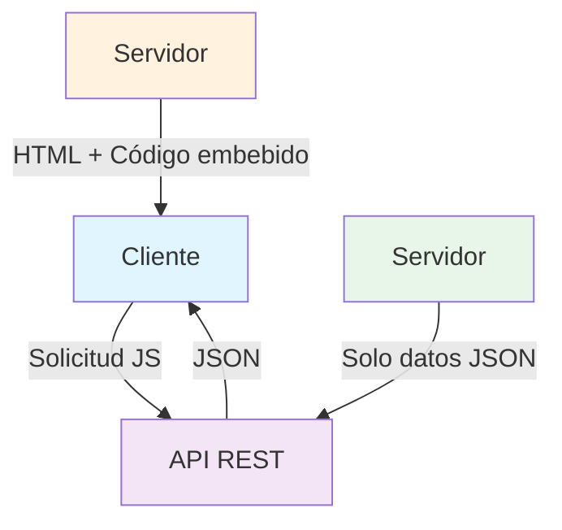

- [7. Lenguajes y Frameworks de Programación en Entorno Servidor](#7-lenguajes-y-frameworks-de-programación-en-entorno-servidor)
  - [7.1. Tipos de Ejecución de Lenguajes del Lado del Servidor](#71-tipos-de-ejecución-de-lenguajes-del-lado-del-servidor)
  - [7.2. Plataformas Web Libres y Propietarias](#72-plataformas-web-libres-y-propietarias)
  - [7.3. Tecnologías para el Desarrollo de Servicios](#73-tecnologías-para-el-desarrollo-de-servicios)
  - [7.4. Integración del Código con Lenguajes de Marcas](#74-integración-del-código-con-lenguajes-de-marcas)

# 7. Lenguajes y Frameworks de Programación en Entorno Servidor

## 7.1. Tipos de Ejecución de Lenguajes del Lado del Servidor

Los lenguajes de programación utilizados en el lado del servidor se ejecutan de diferentes maneras. Debemos distinguir tres grandes grupos:

*   **Lenguajes de Guiones (Scripting)**: Los programas se ejecutan directamente a partir de su código fuente. Un intérprete procesa el código línea por línea y genera la respuesta. Pertenecen a este grupo Perl, Python, PHP y ASP (el precursor de ASP.NET). Tienen la ventaja de que no es necesario traducir el código fuente para ser ejecutados, lo que aumenta su portabilidad, pero ofrecen un rendimiento inferior.

*   **Lenguajes Compilados a Código Nativo**: El código fuente se traduce completamente a código máquina antes de la ejecución. Los programas se almacenan en modo binario y se ejecutan directamente. Son los más rápidos, pero presentan problemas de integración con el servidor web, ya que no están pensados para ejecutarse en este entorno. No son portables entre distintas plataformas y no reutilizan procesos para atender a varias peticiones.

*   **Lenguajes Compilados a Código Intermedio**: El código fuente se compila a un formato intermedio que luego es ejecutado por una máquina virtual. Operan de esta forma Java EE (Servlets, JSP) y ASP.NET. Ofrecen un equilibrio entre buen rendimiento y portabilidad entre distintas plataformas en las que exista una implementación de la arquitectura (como un contenedor de *servlets* o un servidor de aplicaciones Java EE).

📝 **Nota del Profesor**: Entiende la diferencia entre interpretado y compilado. Los interpretados son más flexibles pero más lentos; los compilados son más rápidos pero menos flexibles.

💡 **Tip del Examinador**: Pregunta típica: "¿Qué tipo de ejecución usa Java?" Respuesta: Compilado a código intermedio (bytecode) que ejecuta la JVM.

---

## 7.2. Plataformas Web Libres y Propietarias

Una plataforma web es el entorno de desarrollo de software empleado para diseñar y ejecutar un sitio web. Generalmente, se compone de cuatro elementos clave:

1.  El **sistema operativo**: Bajo el cual opera el equipo donde se hospedan las páginas web y que representa la base misma del funcionamiento del computador. En ocasiones limita la elección de otros componentes.

2.  El **servidor web**: Es el software que maneja las peticiones desde equipos remotos a través de Internet. En el caso de páginas estáticas, el servidor web simplemente provee el archivo solicitado, el cual se muestra en el navegador. En el caso de sitios dinámicos, el servidor web se encarga de pasar las solicitudes a otros programas que puedan gestionarlas adecuadamente.

3.  El **gestor de bases de datos**: Se encarga de almacenar sistemáticamente un conjunto de registros de datos relacionados para ser usados posteriormente.

4.  Un **lenguaje de programación interpretado**: Que controla las aplicaciones de software que corren en el sitio web.

📝 **Nota del Profesor**: Las plataformas web son el "stack" tecnológico. Conocer LAMP o WISA te ayuda a entender cómo se configuran los servidores.

| Plataforma | Componentes | Tipo |
|------------|-------------|------|
| **LAMP** | Linux, Apache, MySQL, PHP/Perl/Python | Libre |
| **WISA** | Windows, IIS, SQL Server, ASP.NET | Propietario |
| **WAMP** | Windows, Apache, MySQL, PHP | Mixto |
| **WIMP** | Windows, IIS, MySQL, PHP | Mixto |

Algunas plataformas populares incluyen:

*   **LAMP**: Combina **L**inux, **A**pache, **M**ySQL (o MariaDB) y **P**HP/Perl/Python. Es una plataforma de código abierto muy difundida.

*   **WISA**: Integra **W**indows, **I**IS (Internet Information Services), **S**QL Server y **A**SP/ASP.NET. Es una plataforma propietaria de Microsoft.

*   **WAMP**: Consiste en **W**indows, **A**pache, **M**ySQL y **P**HP. Es una configuración común para entornos de desarrollo local, a menudo facilitada por paquetes como XAMPP.

*   **WIMP**: Otra combinación para Windows, con **W**indows, **I**IS, **M**ySQL y **P**HP.

💡 **Tip del Examinador**: En el examen pueden preguntar qué significa cada letra de LAMP o WISA. Asegúrate de conocerlas.

---

## 7.3. Tecnologías para el Desarrollo de Servicios

El desarrollo de servicios se centra en la creación de APIs para que las aplicaciones se comuniquen. Las tecnologías varían según el lenguaje y el paradigma de la API.

| Tecnología | Lenguaje | Uso Principal | Ejemplos de Frameworks/Librerías |
|------------|----------|---------------|----------------------------------|
| **Java con Spring Boot** | Java | APIs RESTful, microservicios, aplicaciones web de alta escala, *enterprise*. | Spring MVC, Spring Web Flux, Spring Data REST, Hibernate. |
| **C# con ASP.NET Core** | C# | APIs RESTful, microservicios, servicios en la nube, aplicaciones web empresariales. | ASP.NET Core Web API. |
| **PHP con Laravel** | PHP | APIs RESTful, aplicaciones web con MVC, desarrollo rápido. | Laravel API Resources, Symfony. |
| **Node.js (JavaScript)** | JavaScript | APIs RESTful, microservicios, aplicaciones en tiempo real, *Full-stack* JavaScript. | Express.js, NestJS, Hapi.js, Meteor.js. |
| **Python con Django/Flask** | Python | APIs RESTful, aplicaciones web complejas, Machine Learning, backend de datos. | Django REST Framework, Flask-RESTful. |
| **Ruby con Rails** | Ruby | APIs RESTful, aplicaciones web con MVC, desarrollo rápido. | Ruby on Rails. |
| **gRPC** | Varios | Comunicación de alto rendimiento entre microservicios, *backend-to-backend*. | Soporte nativo en Java, C#, Python, Go, Node.js, etc. |

📝 **Nota del Profesor**: Node.js permite usar JavaScript en el servidor, lo que facilita el desarrollo full-stack. Es una opción muy popular para APIs modernas.

⚠️ **Advertencia de Seguridad**: Al desarrollar APIs, siempre implementar autenticación y autorización. No expongas datos sensibles en las respuestas.

---

## 7.4. Integración del Código con Lenguajes de Marcas

Una técnica fundamental para crear páginas web dinámicas es integrar código de programación directamente dentro de lenguajes de marcado como HTML. Esto permite generar dinámicamente secciones de contenido HTML basándose en la lógica del programa.

*   En el modelo **MVC (Modelo-Vista-Controlador)**, esta combinación se realiza en el **lado del servidor**. El lenguaje de programación (ej. PHP, Python) se incrusta en el HTML, y el documento web resultante se envía al cliente desde el servidor.

*   En aplicaciones web basadas en **servicios REST**, la combinación se lleva a cabo en el **lado del cliente**. El lenguaje de programación (JavaScript o TypeScript) consume datos JSON del servidor y modifica el HTML de forma dinámica en el navegador del usuario.

Por ejemplo, un bucle en PHP puede recorrer una lista de productos y crear un bloque HTML para cada uno. Los lenguajes de programación utilizan etiquetas especiales (como `<?php ... ?>` en PHP) para delimitar el código incrustado.

📝 **Nota del Profesor**: En el primer proyecto usaréis código embebido en el servidor (como JSP o PHP). En proyectos posteriores, migraréis a APIs REST con frontend separado.

💡 **Tip del Examinador**: En el examen práctico, os pedirán identificar qué código se ejecuta en el servidor y qué código se ejecuta en el cliente.

---

