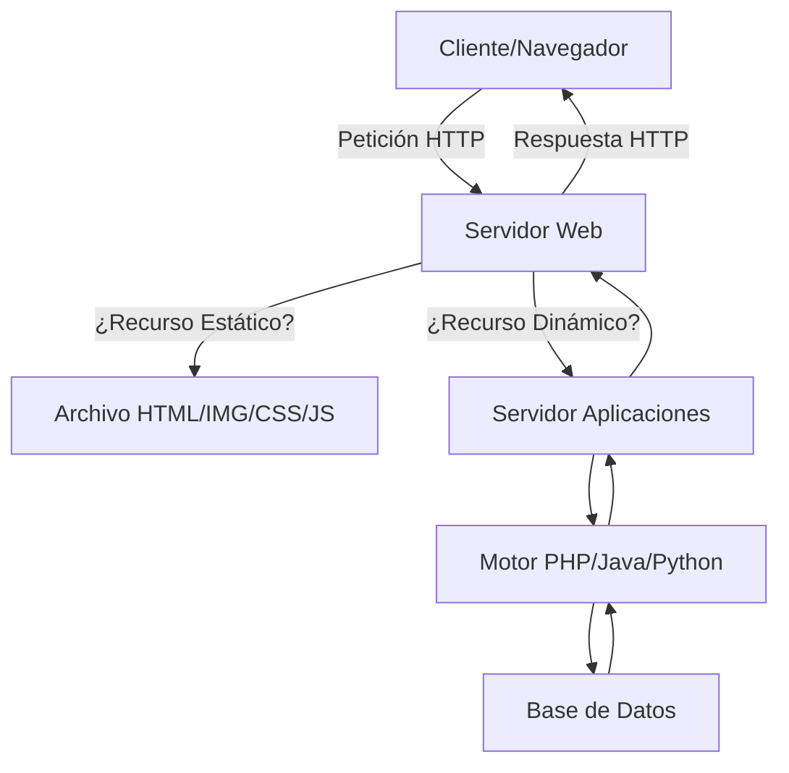
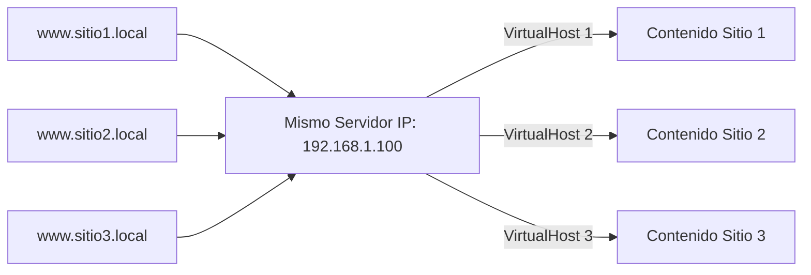
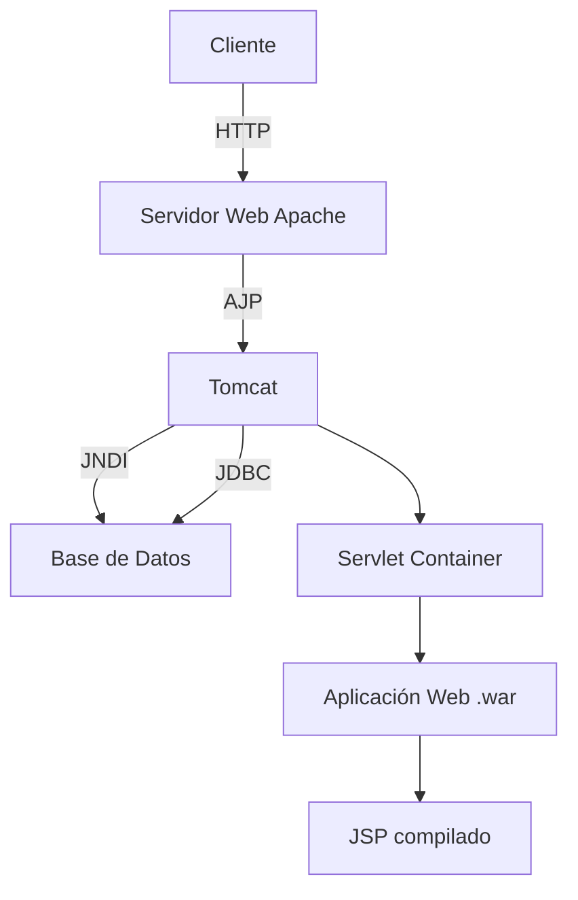
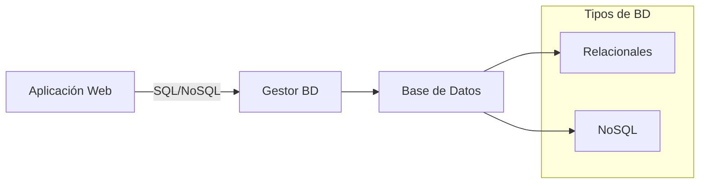

- [8. Funcionamiento y Configuración de Servidores Web y de Aplicaciones](#8-funcionamiento-y-configuración-de-servidores-web-y-de-aplicaciones)
  - [8.1. Servidores Web: Apache y Nginx](#81-servidores-web-apache-y-nginx)
    - [8.1.1. Instalación y Configuración Básica de Apache (Linux)](#811-instalación-y-configuración-básica-de-apache-linux)
    - [8.1.2. Arranque y Detención del Servicio Apache](#812-arranque-y-detención-del-servicio-apache)
    - [8.1.3. Configuración de Hosts Virtuales](#813-configuración-de-hosts-virtuales)
  - [8.2. Servidores de Aplicaciones: Tomcat](#82-servidores-de-aplicaciones-tomcat)
    - [8.2.1. Instalación y Configuración Básica de Tomcat (requisito JDK)](#821-instalación-y-configuración-básica-de-tomcat-requisito-jdk)
  - [8.3. Gestores de Bases de Datos](#83-gestores-de-bases-de-datos)


# 8. Funcionamiento y Configuración de Servidores Web y de Aplicaciones

## 8.1. Servidores Web: Apache y Nginx

Un **servidor web** es un programa que se ejecuta continuamente en un ordenador, esperando peticiones de un cliente (un navegador) y respondiendo con el recurso solicitado (páginas web, imágenes, etc.). Puede servir contenido estático o delegar la ejecución de aplicaciones para generar contenido dinámico.



**Apache HTTP Server** es uno de los servidores web más populares y utilizados, conocido por ser de código abierto y gratuito, disponible para Windows y GNU/Linux.

| Característica | Apache | Nginx |
|----------------|--------|-------|
| **Arquitectura** | Proceso-hilo (process-based) | Event-driven (asíncrono) |
| **Rendimiento** | Bueno para sitios pequeños/medianos | Excelente para alto tráfico |
| **Consumo Memoria** | Mayor bajo carga alta | Menor uso de recursos |
| **Configuración** | .htaccess distribuido | Centralizada |
| **Uso Común** | Alojamiento compartido, CMS | APIs, microservicios, reverse proxy |

*   **Características de Apache**: Apache se caracteriza por su **modularidad**, lo que permite activar o desactivar módulos específicos (ej., para PHP, SSL, control de acceso) para extender su funcionalidad. El archivo principal de configuración suele ser `apache2.conf` o `httpd.conf`.

📝 **Nota del Profesor**: Apache es ideal para principiantes. Su archivo `.htaccess` permite configurar el sitio sin acceder al servidor principal. Nginx es más rápido pero más complejo de configurar.

---

### 8.1.1. Instalación y Configuración Básica de Apache (Linux)

En sistemas Linux basados en Debian/Ubuntu, Apache se instala fácilmente:

```bash
# Instalación
sudo apt update
sudo apt install apache2

# Verificar estado
sudo systemctl status apache2

# Probar funcionamiento
curl http://localhost
```

Apache sirve las páginas web desde el directorio especificado por la directiva `DocumentRoot`, que por defecto suele ser `/var/www/html/`.

**Directivas Básicas de Configuración**:

| Directiva | Descripción | Ejemplo |
|-----------|-------------|---------|
| `ServerRoot` | Directorio base de configuración | `/etc/apache2/` |
| `ServerName` | Nombre del servidor | `www.ejemplo.local` |
| `Listen` | Puerto de escucha | `Listen 80` |
| `DocumentRoot` | Directorio de documentos | `/var/www/html/` |
| `ErrorLog` | Archivo de errores | `/var/log/apache2/error.log` |
| `Timeout` | Tiempo máximo de espera | `Timeout 300` |

```apache
# Ejemplo de configuración básica
ServerRoot "/etc/apache2"
ServerName www.misitio.local
Listen 80
DocumentRoot "/var/www/misitio"

<Directory "/var/www/misitio">
    Options Indexes FollowSymLinks
    AllowOverride All
    Require all granted
</Directory>

ErrorLog ${APACHE_LOG_DIR}/error.log
```

📝 **Nota del Profesor**: Después de modificar la configuración, siempre ejecutad `apache2ctl configtest` para verificar la sintaxis antes de reiniciar.

---

### 8.1.2. Arranque y Detención del Servicio Apache

En sistemas Linux, Apache se puede controlar utilizando systemctl o service:

```bash
# Con systemctl
sudo systemctl start apache2    # Iniciar
sudo systemctl stop apache2     # Detener
sudo systemctl restart apache2  # Reiniciar
sudo systemctl reload apache2   # Recargar config sin perder conexiones

# Con service (compatible con init.d)
sudo service apache2 start
sudo service apache2 stop
sudo service apache2 restart
sudo service apache2 status

# Verificar sintaxis de configuración
sudo apache2ctl configtest
```

💡 **Tip del Examinador**: El comando `reload` es preferible a `restart` cuando se modifican configuraciones pero no se necesita reiniciar el servicio por completo.

---

### 8.1.3. Configuración de Hosts Virtuales

Los **Virtual Hosts** son una funcionalidad clave que permite a un único servidor físico alojar múltiples sitios web o dominios independientes.



| Tipo | Descripción | Ejemplo |
|------|-------------|---------|
| **Basado en Nombre** | Misma IP, diferentes dominios | `www.a.com` y `www.b.com` |
| **Basado en IP** | Diferente IP por sitio | Requiere múltiples IPs |
| **Mixto** | Combinación de ambos | IP única con varios nombres |

**Ejemplo de VirtualHost basado en nombre**:

```apache
# /etc/apache2/sites-available/sitio1.conf
<VirtualHost *:80>
    ServerName www.sitio1.local
    ServerAlias sitio1.local
    DocumentRoot /var/www/sitio1
    
    <Directory /var/www/sitio1>
        Options Indexes FollowSymLinks
        AllowOverride All
        Require all granted
    </Directory>
    
    ErrorLog ${APACHE_LOG_DIR}/sitio1-error.log
    CustomLog ${APACHE_LOG_DIR}/sitio1-access.log combined
</VirtualHost>
```

**Comandos para gestionar VirtualHosts**:

```bash
# Habilitar sitio
sudo a2ensite sitio1.conf

# Deshabilitar sitio
sudo a2dissite sitio1.conf

# Listar sitios habilitados
ls /etc/apache2/sites-enabled/

# Habilitar módulo (ej. SSL)
sudo a2enmod ssl
sudo a2dissite ssl
```

💡 **Tip del Examinador**: Los archivos de configuración en sites-available son solo plantillas. Los sitios realmente activos están en sites-enabled mediante enlaces simbólicos.

⚠️ **Advertencia de Seguridad**: El directorio DocumentRoot nunca debe tener permisos 777. Usar 755 para directorios y 644 para archivos.

---

## 8.2. Servidores de Aplicaciones: Tomcat

Un **servidor de aplicaciones** es un software que proporciona servicios adicionales a los de un servidor web. Se especializa en contenido dinámico, ofrece servicios adicionales como balanceo de carga o *clustering*, y se integra frecuentemente con bases de datos. Simplifican el desarrollo al permitir ensamblar aplicaciones a partir de componentes predefinidos.



**Apache Tomcat** es un servidor de aplicaciones muy utilizado, que funciona como un contenedor de *servlets* y JSP. Es la implementación de referencia para ejecutar aplicaciones Java EE.

| Componente | Función |
|------------|---------|
| **Catalina** | Contenedor de Servlets (maneja el ciclo de vida) |
| **Jasper** | Motor JSP (compila JSP a Servlets) |
| **Coyote** | Conector HTTP |
| **Cluster** | Balanceo de carga y replicación de sesiones |

📝 **Nota del Profesor**: Tomcat NO es un servidor de aplicaciones Java EE completo. Para funcionalidades empresariales completas, necesitarías WildFly, JBoss o WebLogic.

---

### 8.2.1. Instalación y Configuración Básica de Tomcat (requisito JDK)

La instalación de cualquier versión de Tomcat requiere que el **Kit de Desarrollo de Java (JDK)** esté previamente instalado:

```bash
# Verificar Java instalado
java -version
javac -version

# Instalación de OpenJDK (si no está instalado)
sudo apt install openjdk-17-jdk

# Configurar JAVA_HOME
echo 'export JAVA_HOME=/usr/lib/jvm/java-17-openjdk-amd64' >> ~/.bashrc
echo 'export PATH=$JAVA_HOME/bin:$PATH' >> ~/.bashrc
source ~/.bashrc
```

**Instalación de Tomcat**:

```bash
# Descargar Tomcat
wget https://archive.apache.org/dist/tomcat/tomcat-10/v10.1.19/bin/apache-tomcat-10.1.19.tar.gz

# Extraer
sudo tar -xzf apache-tomcat-10.1.19.tar.gz -C /opt/
sudo ln -s /opt/apache-tomcat-10.1.19 /opt/tomcat

# Configurar usuarios (editar conf/tomcat-users.xml)
sudo nano /opt/tomcat/conf/tomcat-users.xml
```

**Estructura de directorios de Tomcat**:

| Directorio | Descripción | Contenido |
|------------|-------------|-----------|
| `/bin` | Scripts de control | startup.sh, shutdown.sh |
| `/conf` | Archivos configuración | server.xml, web.xml |
| `/webapps` | Aplicaciones web | .war files desplegados |
| `/logs` | Archivos de registro | catalina.out |
| `/lib` | Bibliotecas | JARs del servidor |

**Gestión del servicio Tomcat**:

```bash
# Iniciar Tomcat
/opt/tomcat/bin/startup.sh

# Detener Tomcat
/opt/tomcat/bin/shutdown.sh

# Ver logs
tail -f /opt/tomcat/logs/catalina.out

# Verificar funcionamiento
curl http://localhost:8080
```

**Configuración de conectores (server.xml)**:

```xml
<!-- /opt/tomcat/conf/server.xml -->
<Connector port="8080" protocol="HTTP/1.1"
           connectionTimeout="20000"
           redirectPort="8443"
           maxThreads="150"
           minSpareThreads="25"/>

<!-- Conector AJP para Apache -->
<Connector protocol="AJP/1.3"
           address="::1"
           port="8009"
           redirectPort="8443"/>
```

📝 **Nota del Profesor**: El puerto 8080 es el por defecto de Tomcat. En producción, se suele usar Apache o Nginx como reverse proxy en el puerto 80/443, y Tomcat en un puerto interno.

💡 **Tip del Examinador**: Pregunta frecuente: "¿Qué significa AJP?" Apache JServ Protocol. Es un protocolo binario más eficiente que HTTP para comunicar Apache con Tomcat.

---

## 8.3. Gestores de Bases de Datos

Los **gestores de bases de datos** son componentes fundamentales en cualquier plataforma web moderna. Son software encargados de almacenar, estructurar y recuperar grandes volúmenes de datos de manera eficiente.



**Comparativa de Gestores de Bases de Datos**:

| Gestor | Tipo | Licencia | Uso Común | Ventajas Principal |
|--------|------|----------|-----------|-------------------|
| **MySQL** | Relacional | GPL | Aplicaciones web, CMS | Popularidad, integración PHP |
| **MariaDB** | Relacional | GPL | Reemplazo de MySQL | Rendimiento, código abierto |
| **PostgreSQL** | Relacional | BSD | Aplicaciones enterprise | Estándares, extensibilidad |
| **SQL Server** | Relacional | Propietaria | Entorno Microsoft | Integración .NET, herramientas |
| **MongoDB** | Documentos | SSPL | Big Data, IoT | Flexibilidad, escalabilidad |
| **Redis** | Clave-valor | BSD | Caché, sesiones | Velocidad, estructuras datos |

*   **MySQL / MariaDB**: Son gestores de bases de datos relacionales de código abierto, muy populares por su eficiencia y velocidad, a menudo utilizados en combinación con PHP. MariaDB es un *fork* de MySQL completamente libre.
*   **PostgreSQL**: Otro potente gestor de bases de datos relacionales de código abierto, conocido por su robustez y cumplimiento de estándares.
*   **SQL Server**: Es el sistema gestor de bases de datos de Microsoft, típicamente empleado en plataformas WISA.
*   **MongoDB**: Es un gestor de bases de datos NoSQL orientado a documentos, ideal para aplicaciones que requieren alta escalabilidad y flexibilidad en el esquema de datos.

**Ejemplo de conexión desde PHP**:

```php
<?php
// MySQLi orientado a objetos
$servername = "localhost";
$username = "usuario";
$password = "contraseña";
$database = "miapp";

$conn = new mysqli($servername, $username, $password, $database);

if ($conn->connect_error) {
    die("Conexión fallida: " . $conn->connect_error);
}

$sql = "SELECT id, nombre FROM usuarios";
$result = $conn->query($sql);

while($row = $result->fetch_assoc()) {
    echo "ID: " . $row["id"] . " - Nombre: " . $row["nombre"] . "<br>";
}

$conn->close();
?>
```

📝 **Nota del Profesor**: Para este módulo, MySQL/MariaDB son los más usados. En ciclos superiores profundizaréis en PostgreSQL y bases de datos NoSQL.

⚠️ **Advertencia de Seguridad**: NUNCA concatenar variables directamente en SQL. Usar consultas preparadas (prepared statements) para prevenir SQL Injection.

---
