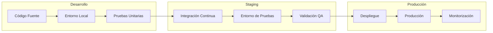
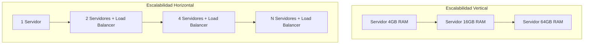
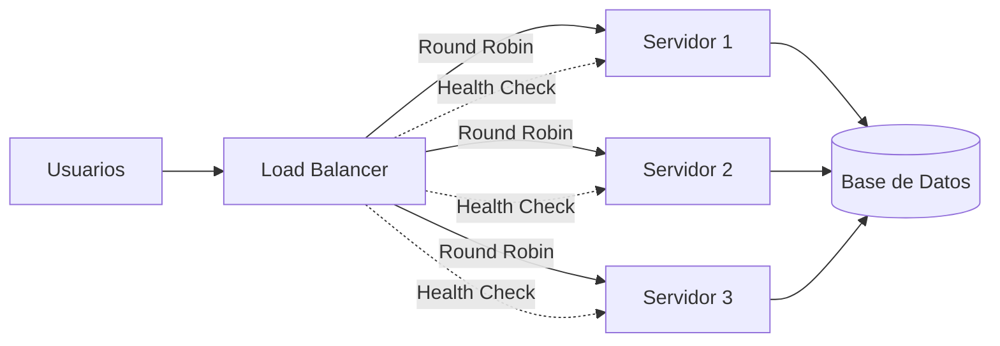
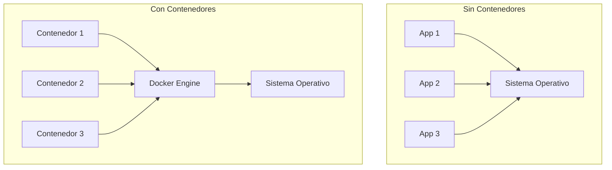
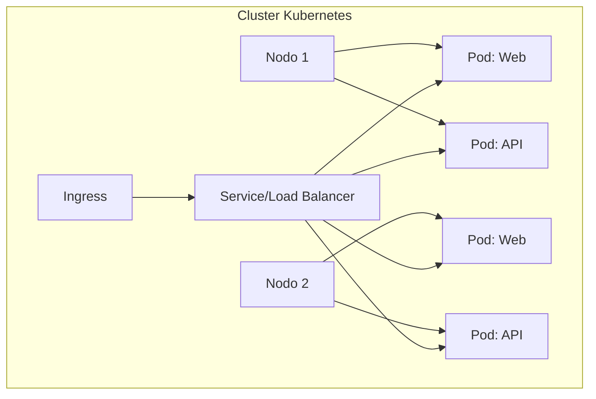
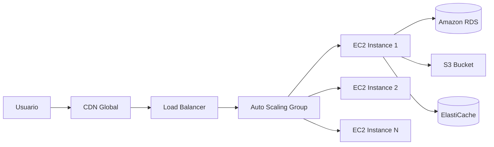
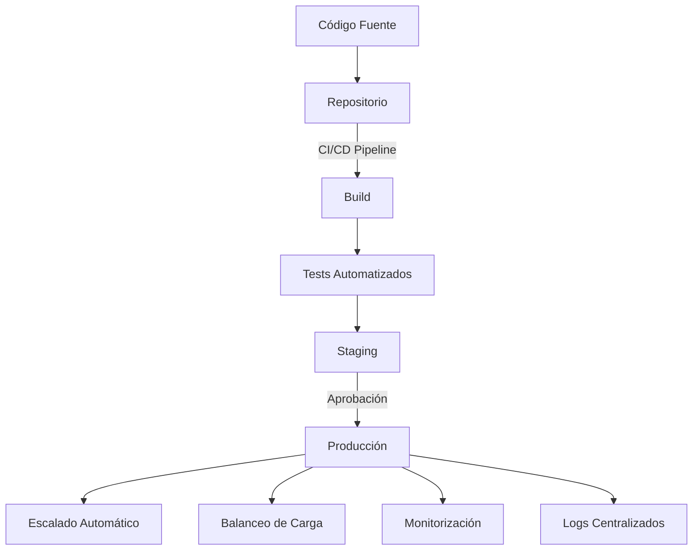
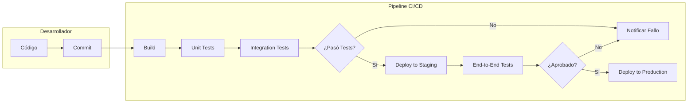

- [9. Despliegue de Aplicaciones Web](#9-despliegue-de-aplicaciones-web)
  - [9.1. Concepto de Despliegue](#91-concepto-de-despliegue)
  - [9.2. Escalabilidad (Vertical y Horizontal, Clusters y Balanceadores de Carga)](#92-escalabilidad-vertical-y-horizontal-clusters-y-balanceadores-de-carga)
  - [9.3. Despliegue en Contenedores (Docker, Kubernetes)](#93-despliegue-en-contenedores-docker-kubernetes)
  - [9.4. Despliegue en la Nube (AWS, Google Cloud, Azure)](#94-despliegue-en-la-nube-aws-google-cloud-azure)
  - [9.5. Introducción a la Integración Continua / Despliegue Continuo (CI/CD)](#95-introducción-a-la-integración-continua--despliegue-continuo-cicd)


# 9. Despliegue de Aplicaciones Web

## 9.1. Concepto de Despliegue

El **despliegue** (deployment) es el proceso de poner en funcionamiento una aplicación web en un entorno de producción, haciéndola accesible para los usuarios finales. Es el paso final del desarrollo donde la aplicación pasa del entorno de desarrollo/pruebas al mundo real.



Para desplegar una aplicación web, se necesitan varios elementos:

| Elemento | Descripción | Ejemplos |
|----------|-------------|----------|
| **Software** | Sistema operativo, servidor web, runtime | Linux, Apache, PHP, JDK |
| **Hardware** | Recursos físicos del servidor | CPU, RAM, almacenamiento |
| **Dependencias** | Librerías y paquetes del proyecto | Composer, Maven, npm |
| **Configuración** | Ajustes específicos del entorno | Variables de entorno, .env |

📝 **Nota del Profesor**: El despliegue NO es solo "subir archivos al servidor". Incluye configurar el entorno, instalar dependencias, configurar la base de datos y verificar que todo funciona.

💡 **Tip del Examinador**: Pregunta típica de examen: "¿Qué elementos son necesarios para desplegar una aplicación web?" Respuesta: Software, hardware, dependencias y configuración.

---

## 9.2. Escalabilidad (Vertical y Horizontal, Clusters y Balanceadores de Carga)

La **escalabilidad** es la capacidad fundamental de un sistema web para soportar un aumento significativo en el número de usuarios o la carga de trabajo sin comprometer su rendimiento o funcionalidad.



**Comparativa de Escalabilidad**:

| Aspecto | Vertical (Scale Up) | Horizontal (Scale Out) |
|---------|---------------------|------------------------|
| **Definición** | Aumentar recursos de un servidor | Añadir más servidores |
| **Coste** | Limitado por hardware disponible | Lineal (más servidores) |
| **Límite** | Techo de hardware | Límite práctico (coste/red) |
| **Complejidad** | Baja | Alta (sincronización, estado) |
| **Downtime** | Requiere parada | Sin parada con balanceo |

**Conceptos Clave**:

*   **Escalabilidad Vertical ("Scale Up")**: Consiste en aumentar los recursos (CPU, RAM, almacenamiento) de un único servidor existente.
*   **Escalabilidad Horizontal ("Scale Out")**: Implica añadir más servidores o "nodos" al sistema para distribuir la carga de trabajo entre ellos.
*   **Clusters**: Son agrupaciones de servidores que operan conjuntamente como una única entidad lógica, lo que mejora la disponibilidad y el rendimiento.
*   **Balanceadores de Carga**: Son dispositivos o software que distribuyen el tráfico de red de manera inteligente entre múltiples servidores.

**Algoritmos de Balanceo de Carga**:

| Algoritmo | Descripción | Uso |
|-----------|-------------|-----|
| **Round Robin** | Ciclo secuencial entre servidores | Servidores equivalentes |
| **Least Connections** | Menor número de conexiones activas | Sesiones largas |
| **IP Hash** | Misma IP siempre al mismo servidor | Sesiones sticky |
| **Weighted** | Reparto según capacidad | Servidores diferentes |
| **Least Response Time** | Menor tiempo de respuesta | Optimización performance |



📝 **Nota del Profesor**: La escalabilidad horizontal es más económica y flexible que la vertical, pero requiere que la aplicación esté diseñada para funcionar en集群 (sin estado compartido).

⚠️ **Advertencia de Seguridad**: Los balanceadores de carga son puntos únicos de fallo (SPOF). Configurar redundancia en los balanceadores.

---

## 9.3. Despliegue en Contenedores (Docker, Kubernetes)

El despliegue en contenedores es una estrategia muy extendida para aplicaciones dinámicas, ofreciendo portabilidad y consistencia entre diferentes entornos.



**Docker** es una plataforma de gestión de contenedores que facilita la creación, prueba y despliegue rápido de aplicaciones mediante el uso de "imágenes". Los contenedores proporcionan un método de virtualización ligero del sistema operativo.

**Estructura Dockerfile**:

```dockerfile
# Dockerfile para aplicación PHP
FROM php:8.2-apache

# Instalar extensiones necesarias
RUN docker-php-ext-install mysqli pdo pdo_mysql

# Configurar Apache
RUN a2enmod rewrite

# Copiar aplicación
COPY src/ /var/www/html/

# Definir puerto
EXPOSE 80
```

**Comandos Docker básicos**:

```bash
# Construir imagen
docker build -t miapp:latest .

# Ejecutar contenedor
docker run -d -p 8080:80 --name miapp-container miapp:latest

# Ver contenedores activos
docker ps

# Ver logs
docker logs -f miapp-container

# Detener/iniciar
docker stop miapp-container
docker start miapp-container

# Acceder al contenedor
docker exec -it miapp-container bash
```

**Docker Compose** es una herramienta que simplifica la orquestación de múltiples contenedores:

```yaml
# docker-compose.yml
version: '3.8'

services:
  web:
    image: nginx:alpine
    ports:
      - "80:80"
    volumes:
      - ./src:/usr/share/nginx/html
    depends_on:
      - php
  
  php:
    build: .
    volumes:
      - ./src:/var/www/html
  
  db:
    image: mysql:8.0
    environment:
      MYSQL_ROOT_PASSWORD: secret
      MYSQL_DATABASE: miapp
    volumes:
      - mysql_data:/var/lib/mysql

volumes:
  mysql_data:
```

**Kubernetes** es una plataforma de orquestación de contenedores que automatiza el despliegue, el escalado y la gestión de aplicaciones en contenedores.



| Concepto | Descripción |
|----------|-------------|
| **Pod** | Unidad más pequeña (uno o más contenedores) |
| **Deployment** | Define cómo escalar y actualizar pods |
| **Service** | Punto de acceso estable a pods |
| **Ingress** | Control de acceso HTTP/HTTPS |
| **ConfigMap** | Configuración sin código |

📝 **Nota del Profesor**: Docker es ideal para desarrollo y despliegues simples. Kubernetes es para producción con alta disponibilidad. Para este módulo, basta con saber qué son y sus conceptos básicos.

💡 **Tip del Examinador**: Diferencia clave: Docker = contenedores individuales, Kubernetes = orquestación de contenedores (múltiples máquinas).

---

## 9.4. Despliegue en la Nube (AWS, Google Cloud, Azure)

El despliegue en la nube es una estrategia que ofrece escalabilidad automática, acceso a servicios gestionados y alta disponibilidad.



**Proveedores Comunes de Nube**:

| Proveedor | Siglas | Servicios Clave |
|-----------|--------|-----------------|
| **Amazon Web Services** | AWS | EC2, RDS, S3, Lambda, Elastic Beanstalk |
| **Google Cloud Platform** | GCP | Compute Engine, Cloud SQL, Cloud Storage, App Engine |
| **Microsoft Azure** | Azure | Virtual Machines, Azure SQL, Blob Storage, App Service |

**Proceso de Despliegue en la Nube**:



1.  **Configuración de la Infraestructura**: Creación de instancias de servidores virtuales, bases de datos y otros recursos necesarios.
2.  **Implementación del Código**: Utilización de servicios PaaS (Plataforma como Servicio).
3.  **Configuración de Autoscaling y Balanceadores de Carga**: Ajustes para manejar eficientemente la carga de trabajo.
4.  **Configuración de Seguridad**: Firewalls, grupos de seguridad y certificados SSL.
5.  **Pruebas y Validación**: Tests exhaustivos para asegurar funcionalidad y rendimiento.
6.  **Monitorización y Alerta**: Herramientas para detectar problemas en tiempo real.

**Modelos de Servicio en la Nube**:

| Modelo | Descripción | Ejemplos |
|--------|-------------|----------|
| **IaaS** | Infraestrutura como servicio | AWS EC2, Azure VMs |
| **PaaS** | Plataforma como servicio | Heroku, App Engine, Elastic Beanstalk |
| **SaaS** | Software como servicio | Gmail, Office 365 |
| **FaaS/Serverless** | Funciones como servicio | AWS Lambda, Cloud Functions |

📝 **Nota del Profesor**: Para este módulo, el modelo PaaS es el más relevante. Servicios como Heroku o Railway permiten desplegar sin gestionar servidores.

💡 **Tip del Examinador**: Ventaja principal de la nube: escalabilidad bajo demanda. Pagas solo por lo que usas.

⚠️ **Advertencia de Seguridad**: La nube no es segura por defecto. Configurar correctamente grupos de seguridad, IAM y cifrado.

---

## 9.5. Introducción a la Integración Continua / Despliegue Continuo (CI/CD)

Las prácticas de **CI/CD** (Integración Continua / Entrega Continua / Despliegue Continuo) son un conjunto de metodologías y herramientas que automatizan el ciclo de vida del desarrollo de software.



| Práctica | Descripción | Objetivo |
|----------|-------------|----------|
| **CI** (Integración Continua) | Frequent code integration + automated tests | Detectar errores temprano |
| **CD** (Entrega Continua) | Código siempre listo para desplegar | Deployment automático a staging |
| **CD** (Despliegue Continuo) | Cada cambio pasa a producción | Release automático |

**Herramientas CI/CD Comunes**:

| Herramienta | Tipo | Uso |
|-------------|------|-----|
| **GitHub Actions** | Cloud | Automatización en GitHub |
| **GitLab CI/CD** | Cloud/Self-hosted | Integrado en GitLab |
| **Jenkins** | Self-hosted | Muy flexible, extensible |
| **CircleCI** | Cloud | Rápido, fácil configuración |
| **Travis CI** | Cloud | Popular en proyectos OSS |

**Ejemplo de GitHub Actions**:

```yaml
# .github/workflows/ci.yml
name: CI Pipeline

on:
  push:
    branches: [main]
  pull_request:
    branches: [main]

jobs:
  build-and-test:
    runs-on: ubuntu-latest
    
    steps:
      - uses: actions/checkout@v3
      
      - name: Setup Node.js
        uses: actions/setup-node@v3
        with:
          node-version: '18'
          
      - name: Install dependencies
        run: npm ci
        
      - name: Run tests
        run: npm test
        
      - name: Build
        run: npm run build
        
      - name: Deploy to Staging
        if: github.ref == 'refs/heads/main'
        run: echo "Deploying to staging..."
```

📝 **Nota del Profesor**: CI/CD no es solo para grandes empresas. Incluso proyectos pequeños se benefician de una pipeline básica que ejecute tests automáticamente.

💡 **Tip del Examinador**: Diferencia entre CI, CD y CD: CI = integrar frecuentemente, CD (Delivery) = listo para producción, CD (Deployment) = automático a producción.

⚠️ **Advertencia de Seguridad**: Las credenciales de CI/CD son muy valiosas. Usar secretos cifrados, nunca hardcodear tokens.


