- [10. Resumen y Checklist de Supervivencia](#10-resumen-y-checklist-de-supervivencia)
  - [10.1. Mapa Conceptual de la Unidad](#101-mapa-conceptual-de-la-unidad)
  - [10.2. Conceptos Clave Detallados](#102-conceptos-clave-detallados)
    - [Desarrollo Web: Cliente vs Servidor](#desarrollo-web-cliente-vs-servidor)
    - [Arquitecturas Web](#arquitecturas-web)
    - [Protocolo HTTP/HTTPS](#protocolo-httphttps)
    - [Servicios Web y APIs](#servicios-web-y-apis)
    - [Web Dinámica](#web-dinámica)
  - [10.3. Checklist de Supervivencia](#103-checklist-de-supervivencia)


# 10. Resumen y Checklist de Supervivencia

## 10.1. Mapa Conceptual de la Unidad

```mermaid
graph TD
    UD03[UD03: Arquitectura Web y Despliegue] --> DES[Desarrollo Web]
    UD03 --> ARC[Arquitecturas]
    UD03 --> PRO[Protocolos]
    UD03 --> API[Servicios y APIs]
    UD03 --> WEB[Web Dinámica]
    UD03 --> LEN[Lenguajes y Frameworks]
    UD03 --> SER[Servidores]
    UD03 --> DESP[Despliegue]

    DES --> CLI[Cliente: HTML/CSS/JS]
    DES --> SRV[Servidor: Lógica/BD]
    DES --> API1[APIs]

    ARC --> MVC[Modelo-Vista-Controlador]
    ARC --> MON[Monolítica]
    ARC --> MIC[Microservicios]
    ARC --> SERVE[Serverless]

    PRO --> HTTP[HTTP: Métodos, Cabeceras, Códigos]
    PRO --> HTTPS[HTTPS: SSL/TLS, Certificados]

    API --> REST[REST: JSON, CRUD]
    API --> GQL[GraphQL: Consultas]
    API --> WS[WebSocket: Tiempo Real]
    API --> JWT[JWT: Autenticación]

    WEB --> EST[Estática vs Dinámica]
    WEB --> PHP[PHP, Java, Python, Node.js]

    LEN --> TIP[Tipos: Scripting, Compilado, Intermedio]
    LEN --> PLA[Plataformas: LAMP, WISA, WAMP]

    SER --> APACHE[Apache: Módulos, .htaccess]
    SER --> NGINX[Nginx: Alto rendimiento]
    SER --> TOM[Tomcat: Servlets Java]
    SER --> BDD[Gestores BBDD]

    DESP --> ESC[Escalabilidad: Vertical/Horizontal]
    DESP --> DOC[Docker, Kubernetes]
    DESP --> CLOUD[AWS, Azure, GCP]
    DESP --> CICD[CI/CD: Pipeline]
```



## 10.2. Conceptos Clave Detallados

### Desarrollo Web: Cliente vs Servidor

El desarrollo web se divide en dos entornos principales con responsabilidades específicas:

- **Cliente (Front-end)**: Se ejecuta en el navegador del usuario. Usa HTML, CSS y JavaScript para estructura, estilo e interactividad. Responsible de validaciones preliminares y experiencia de usuario.

- **Servidor (Back-end)**: Se ejecuta en un servidor web o de aplicaciones. Gestiona la lógica de negocio, acceso a bases de datos y generación de contenido dinámico.

📝 **Nota del Profesor**: La validación en el cliente es opcional y mejorable (UX), pero la validación en el servidor es OBLIGATORIA por seguridad. El usuario puede deshabilitar JavaScript.

### Arquitecturas Web

| Arquitectura | Descripción | Ideal para |
|--------------|-------------|------------|
| **Cliente-Servidor** | Modelo fundamental donde clientes piden y servidores ofrecen | Todas las aplicaciones web |
| **Monolítica** | Todo junto en un bloque | Proyectos pequeños, MVPs |
| **De Capas** | Presentación, negocio, datos separados | Aplicaciones empresariales |
| **Microservicios** | Servicios pequeños independientes | Grandes sistemas, equipos múltiples |
| **MVC** | Modelo-Vista-Controlador | Aplicaciones con lógica compleja |

**Patrón MVC**:
- **Modelo**: Datos y acceso a base de datos
- **Vista**: Presentación al usuario
- **Controlador**: Lógica de flujo, recibe acciones del usuario

### Protocolo HTTP/HTTPS

HTTP es el fundamento de la web:
- **Stateless**: Cada petición es independiente
- **Métodos**: GET (leer), POST (crear), PUT (actualizar), DELETE (borrar)
- **Códigos de Estado**: 2XX (éxito), 4XX (error cliente), 5XX (error servidor)

HTTPS añade seguridad con SSL/TLS:
- Cifrado asimétrico para establecer conexión
- Certificados digitales firmados por CA (Autoridad de Certificación)
- Cifrado simétrico para la comunicación

### Servicios Web y APIs

Un servicio web expone datos y funcionalidades a otras aplicaciones (no a usuarios finales).

| Protocolo | Formato | Ideal para |
|-----------|---------|------------|
| **REST** | JSON | APIs públicas, CRUD simple |
| **GraphQL** | JSON | Interfaces complejas, consultas flexibles |
| **WebSocket** | Texto/Binario | Chat, tiempo real |
| **gRPC** | Protobuf | Microservicios alto rendimiento |
| **JWT** | JSON (token) | Autenticación stateless |

### Web Dinámica

- **Estática**: HTML preexistente, sin procesamiento del servidor
- **Dinámica**: Generada en tiempo real según la petición, usa base de datos

**Flujo de una petición dinámica**:
```
Cliente → Servidor Web → Servidor Aplicaciones → Base de Datos
                                    ↓
                          Genera HTML personalizado
                                    ↓
                          Respuesta al cliente
```

## 10.3. Checklist de Supervivencia

Antes de dar por cerrado el tema, asegúrate de poder responder **SÍ** a estas preguntas:

- [ ] ¿Entiendo la diferencia entre Front-end y Back-end y dónde se ejecuta cada uno?
- [ ] ¿Sé explicar qué es MVC y las responsabilidades de Modelo, Vista y Controlador?
- [ ] ¿Conozco la diferencia entre página web estática y dinámica?
- [ ] ¿Puedo explicar por qué HTTP es stateless y cómo se解决这个问题 con sesiones/cookies?
- [ ] ¿Sé diferenciar los métodos HTTP (GET vs POST) y cuándo usar cada uno?
- [ ] ¿Conozco los principales códigos de estado HTTP (200, 404, 500, 401 vs 403)?
- [ ] ¿Entiendo qué es HTTPS y cómo funcionan los certificados digitales?
- [ ] ¿Sé qué es una API y la diferencia entre REST, GraphQL y WebSocket?
- [ ] ¿Conozco las ventajas de microservicios frente a arquitectura monolítica?
- [ ] ¿Sé qué es Docker y por qué se usan contenedores en el despliegue?
- [ ] ¿Entiendo los conceptos de escalabilidad vertical y horizontal?
- [ ] ¿Conozco los proveedores cloud principales (AWS, Azure, GCP)?
- [ ] ¿Sé qué significa CI/CD y por qué es importante automatizar despliegues?
- [ ] ¿Entiendo el formato CLF de logs y por qué es importante la rotación?

💡 **Tip del Examinador**: Las preguntas sobre diferencias (GET vs POST, monolito vs microservicios, estático vs dinámico) son las más frecuentes. Ten claras las comparaciones en formato tabla.
